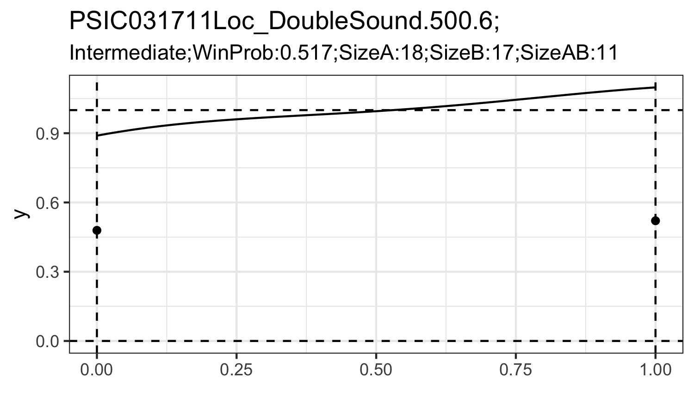

```{r setup, include=FALSE}
knitr::opts_chunk$set(echo = TRUE)
```

## Overview

This package is designed to implement the PRML classifier and PRML filter proposed by Chen and Tokdar (2019).

- `prml_filter()` calculate Bayes factor of Poisson versus Poisson mixtures.
- `prml_classifier()` calculate posterior probabilities under each Poisson mixtures hypotheses.
- `prml_classifier_f()` calculate posterior probabilities under each Poisson mixtures hypotheses and density estimation of mixing density.
- `prml_tests()` output the result of PRML classifier `prml_classifier()` as well as PRML filter `prml_filter()`
- `prml_tests_f()` output the result of PRML classifier `prml_classifier_f()` as well as PRML filter `prml_filter()`

For real data anlaysis, we only need to use function `prml_tests()`, which take the $\{Y^A,Y^B,Y^{AB}\}$ as input. $\{Y^A,Y^B,Y^{AB}\}$ represent spike count data coming from the repeated trials under condition $\{A,B,AB\}$ (single-stimulus trial A, B and dual-stimuli trial AB). We provide a sample code on

- (1) how to extract the spike count triplets from the raw data;
- (2) how to use function `prml_tests()`; 
- (3) simple data visualization on the result. 

If you want to obtain density estimation of the mixing density, replace `prml_tests()` with `prml_tests_f()` in the sample code. See Articles for details.


## Installation

Not yet available in cran. Install the development version for now.

```{r,echo=TRUE, eval=FALSE}
install.packages("prml")
```

## Development version

```{r,echo=TRUE, eval=FALSE}
devtools::install_github("yunranchen/prml")
```

## Result

A classification on the four possible hypotheses before PRML filtering and after PRML filtering process.

```{r, echo=FALSE}
knitr::include_graphics("vignettes/images/plot.png")
```


A density estimation on the mixing density function. (Here only present the 'Mixture' and 'Intermediate' hypotheses.)

```{r, echo=FALSE}

```

