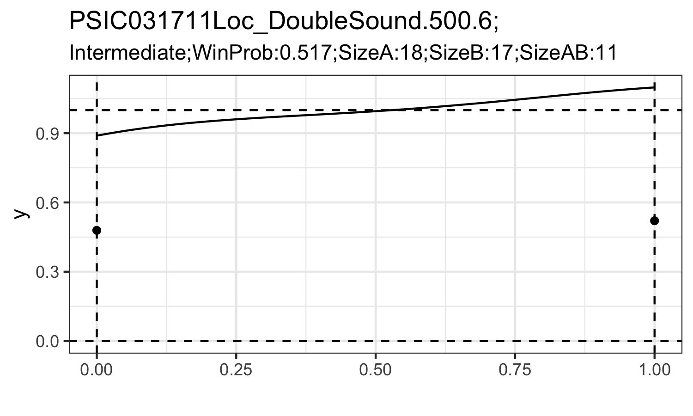

```{r setup, include = FALSE}
knitr::opts_chunk$set(
  collapse = TRUE,
  comment = "#>"
)
```

**prml** is designed to implement the PRML classifier and PRML filter proposed by Chen and Tokdar (2019).

PRML classifier is a hypothesis testing for different types of Poisson mixtures. PRML filter is a hypothesis testing for screening out data with overdispersed Poisson. PRML classifier take second order stochasticity into consideration, helping neuroscientists to classify the activation patterns that a single neuron exhibits when preserving information from multiple stimuli. PRML filter contributes to avoid mistaking trial-to-trial variation as second order stochasticity.

For real data anlaysis, we only need to use function `prml_tests()`, which take the $\{Y^A,Y^B,Y^{AB}\}$ as input. $\{Y^A,Y^B,Y^{AB}\}$ represent spike count data coming from the repeated trials under condition $\{A,B,AB\}$ (single-stimulus trial A, B and dual-stimuli trial AB). We provide a sample code on

- how to extract the spike count triplets from the raw data;
- how to use function `prml_tests()`; 
- simple data visualization on the result. 

If you want to obtain density estimation of the mixing density, replace `prml_tests()` with `prml_tests_f()` in the sample code. 

## Dataset

The raw data is stored as .txt file pairs. One stores the experiment condition and corresponding condition id. The other stores the timepoints of spikes under experiment specified by the id. The raw data included within a pair of .txt files contains multiple experiment triplets. And there are multiple pairs within the folder `Data/JA/`.

The following data shows:

- `prml.from.tri()`: extract spike count triplets from a pair of .txt raw data under specified condition; and apply `prml_tests()` for each spike count triplet.
- `prml.from.fname()`: apply `prml.from.tri()` under all possible conditions within a pair of .txt raw data.
- apply `prml.from.fname()` for all pairs of .txt raw data within a folder. save the output as a .txt file.

## Preparation

```{r,eval=FALSE,echo=TRUE}
# devtools::install_github("yunranchen/prml")
library(prml)
library("statmod")
library("dplyr")
library("purrr")
```

## Example for applying `prml_tests()`

The function `prml.from.tri()` is for:

- Under specified triplets condition $\{A,B,AB\}$, extract spike count triplets from two dataframes `trials` (storing information of triplets condition) and `spiketimes` (storing the timepoints of spikes within trials). 
- Apply `prml_test()` on the spike count triplets.


```{r,eval=FALSE,echo=TRUE}

prml.from.tri <- function(trials, spiketimes, frq = c(1100, 742),
                       pos = c(24, -6), on.reward = TRUE, start.time = 0, 
                       end.time = 600, match.level = FALSE, AB.eqlevel = FALSE,
                       go.by.soff = FALSE, remove.zeros=FALSE, ...){

  attach(trials)
  attach(spiketimes)

  timestamps <- split(TIMES, TRIAL2)
  ntrials <- length(timestamps)
  trial.id <- as.numeric(names(timestamps)) 

  ix1 <- TASKID == 8 & A_FREQ == frq[1] & XA == pos[1]
  ix2 <- TASKID == 8 & A_FREQ == frq[2] & XA == pos[2]
  ix3 <- TASKID == 12 & (A_FREQ == frq[1] & B_FREQ == frq[2] & XA == pos[1] & XB == pos[2]) | (A_FREQ == frq[2] & B_FREQ == frq[1] & XA == pos[2] & XB == pos[1])

  if(on.reward){
    ix1 <- ix1 & REWARD == 1
    ix2 <- ix2 & REWARD == 1
    ix3 <- ix3 & REWARD == 1
  }

  blev <- sort(unique(B_LEVEL[ix3]))
  targ.lev <- blev[blev > 0]
  lev <- "*"
  if(match.level) {
    if(length(targ.lev) > 1) {
      targ.lev <- max(targ.lev)
      warning("Multiple single sound levels, choosing largest one")
    }
    ix1 <- ix1 & A_LEVEL == targ.lev
    ix2 <- ix2 & A_LEVEL == targ.lev
    lev <- as.character(targ.lev)
  }

  if(AB.eqlevel) ix3 <- ix3 & (A_LEVEL == B_LEVEL)

  sing1 <- trials[ix1, 1]
  sing2 <- trials[ix2, 1]
  duplx <- trials[ix3, 1]
  success <- REWARD[ix3]

  if(go.by.soff) end.time <- min(SOFF[ix1 | ix2 | ix3])

  spike.counter <- function(jj){
    jj1 <- match(jj, trial.id)
    spks <- timestamps[[jj1]]
    return(sum(spks > start.time & spks < end.time))
  }

  Acounts <- sapply(sing1, spike.counter)
  Bcounts <- sapply(sing2, spike.counter)
  ABcounts <- sapply(duplx, spike.counter)

  detach(trials)
  detach(spiketimes)

  if ((mean(Acounts)==0)|(mean(Bcounts==0))|(mean(ABcounts==0))){
    stop("All the spike counts are 0 under a specific condition.")
  }
  
  if ((length(Acounts)==1)|(length(Bcounts)==1)|(length(ABcounts)==1)){
    stop("Only 1 available trial under a specific condition.")
  }
  
  s1 <- paste(frq[1],"Hz ",pos[1],"deg ",lev,"Db ", sep = "")
  s2 <- paste(frq[2],"Hz ",pos[2],"deg ",lev,"Db ", sep = "")
  dp <- paste("Duplex: ", lev, "Db ", sep = "")
  
  res=prml_tests(xA=Acounts, xB=Bcounts, xAB=ABcounts, labels = c(s1, s2, dp),e=0,remove.zeros=remove.zeros)
  # By default:
  #remove.zeros = FALSE
  #mu_l="min",mu_u="max",gamma.pars = c(0.5, 2e-10), 
  #n_gq = 20, n_per = 100, alpha = 0.5

  return(res)
}

```

The function  `prml.from.fname()` is for:

- Find all possible conditions within a pair of .txt files
- apply `prml.from.tri()` under all possible triplets


```{r,eval=FALSE,echo=TRUE}
prml.from.fname <- function(fname, data.path = "Data", on.reward = TRUE,
                   match.level = FALSE, AB.eqlevel = FALSE, outfile = "",
                   start = 0, end = 600, remove.zeros = FALSE){

  infile1 <- paste(data.path, "/JA/", fname, ".txt", sep = "")
  
  trials <- read.table(infile1, col.names = c("TRIAL", "TASKID", "A_FREQ", "B_FREQ", "XA", "XB", "REWARD", "A_LEVEL", "B_LEVEL"))

  infile2 <- paste(data.path, "/JA/", fname, "_spiketimes.txt", sep = "")
  
  spiketimes <- read.table(infile2, col.names = c("TRIAL2", "TIMES"))

  FREQS <- unique(c(trials$A_FREQ, trials$B_FREQ))
  alt.freq <- sort(FREQS[FREQS > 0 & FREQS != 742])
  alt.pos <- c(-24, -6, 6, 24)


  for(fr in alt.freq){
    for(po in alt.pos){
      try({lbf <-prml.from.tri(trials, spiketimes, c(fr, 742), c(po, -144/po), on.reward, start, end, match.level, AB.eqlevel, go.by.soff=FALSE, remove.zeros=remove.zeros)%>%unlist(.);
      cat(fname, c(fr, po, lbf), "\n", file = outfile, append = TRUE);
      })
    }
  }
}
  
```

Here the `filenames.txt` is a text file including all the names of the paired files. 

The for loop is for:

- apply `prml.from.fname()` for all pairs of .txt files within the folder.

```{r,eval=FALSE,echo=TRUE}
set.seed(123)
#fnames -- a list of names of the .txt files in the folder
fnames=scan("filenames.txt", "a")
for (file.name in fnames){
  #"Data" is the folder you store all the .txt files
  #"result.txt" is the folder you store the result
  try(prml.from.fname(file.name, data.path = "Data", on.reward = TRUE,
              match.level = FALSE, AB.eqlevel = FALSE, outfile = "result.txt",
              start = 0, end = 600, remove.zeros = FALSE))
}

```

## Example for applying `prml_tests_f()`

- `prml.from.tri.f()`: replace `prml_tests()` in `prml.from.tri()` with `prml_tests_f()`
- `prml.from.fname.f()`: apply `prml.from.tri.f()` and output the density estimation in a separate .txt file.

```{r,eval=FALSE,echo=TRUE}
prml.from.tri.f <- function(trials, spiketimes, frq = c(1100, 742),
                       pos = c(24, -6), on.reward = TRUE, 
                       start.time = 0, end.time = 600,
                       match.level = FALSE, AB.eqlevel = FALSE, go.by.soff = FALSE,
                       remove.zeros=FALSE, ...){

  attach(trials)
  attach(spiketimes)

  timestamps <- split(TIMES, TRIAL2)
  ntrials <- length(timestamps)
  trial.id <- as.numeric(names(timestamps)) ## same as unique(TRIAL2)

  ix1 <- TASKID == 8 & A_FREQ == frq[1] & XA == pos[1]
  ix2 <- TASKID == 8 & A_FREQ == frq[2] & XA == pos[2]
  ix3 <- TASKID == 12 & (A_FREQ == frq[1] & B_FREQ == frq[2] & XA == pos[1] & XB == pos[2]) | (A_FREQ == frq[2] & B_FREQ == frq[1] & XA == pos[2] & XB == pos[1])

  if(on.reward){
    ix1 <- ix1 & REWARD == 1
    ix2 <- ix2 & REWARD == 1
    ix3 <- ix3 & REWARD == 1
  }

  blev <- sort(unique(B_LEVEL[ix3]))
  targ.lev <- blev[blev > 0]
  lev <- "*"
  if(match.level) {
    if(length(targ.lev) > 1) {
      targ.lev <- max(targ.lev)
      warning("Multiple single sound levels, choosing largest one")
    }
    ix1 <- ix1 & A_LEVEL == targ.lev
    ix2 <- ix2 & A_LEVEL == targ.lev
    lev <- as.character(targ.lev)
  }

  if(AB.eqlevel) ix3 <- ix3 & (A_LEVEL == B_LEVEL)

  sing1 <- trials[ix1, 1]
  sing2 <- trials[ix2, 1]
  duplx <- trials[ix3, 1]
  success <- REWARD[ix3]

  if(go.by.soff) end.time <- min(SOFF[ix1 | ix2 | ix3])

  spike.counter <- function(jj){
    jj1 <- match(jj, trial.id)
    spks <- timestamps[[jj1]]
    return(sum(spks > start.time & spks < end.time))
  }

  Acounts <- sapply(sing1, spike.counter)
  Bcounts <- sapply(sing2, spike.counter)
  ABcounts <- sapply(duplx, spike.counter)

  detach(trials)
  detach(spiketimes)

  if ((mean(Acounts)==0)|(mean(Bcounts==0))|(mean(ABcounts==0))){
    stop("All the spike counts are 0 under a specific condition.")
  }
  
  if ((length(Acounts)==1)|(length(Bcounts)==1)|(length(ABcounts)==1)){
    stop("Only 1 available trial under a specific condition.")
  }
  
  s1 <- paste(frq[1],"Hz ",pos[1],"deg ",lev,"Db ", sep = "")
  s2 <- paste(frq[2],"Hz ",pos[2],"deg ",lev,"Db ", sep = "")
  dp <- paste("Duplex: ", lev, "Db ", sep = "")
  res=prml_tests_f(xA=Acounts, xB=Bcounts, xAB=ABcounts, labels = c(s1, s2, dp),e=0,
                   remove.zeros=remove.zeros)
  # By default:
  #remove.zeros = FALSE
  #mu_l="min",mu_u="max",gamma.pars = c(0.5, 2e-10), 
  #n_gq = 20, n_mu = 100, n_per = 100, alpha = 0.5
  
  return(res)
}


```

```{r,eval=FALSE,echo=TRUE}
prml.from.fname.f <- function(fname, data.path = "Data", on.reward = TRUE,
                        match.level = FALSE, AB.eqlevel = FALSE, outfile = "",
                        start = 0, end = 600, remove.zeros = FALSE){

  infile1 <- paste(data.path, "/JA/", fname, ".txt", sep = "")
  
  trials <- read.table(infile1, col.names = c("TRIAL", "TASKID", "A_FREQ", "B_FREQ", "XA", "XB", "REWARD", "A_LEVEL", "B_LEVEL"))

  infile2 <- paste(data.path, "/JA/", fname, "_spiketimes.txt", sep = "")
  spiketimes <- read.table(infile2, col.names = c("TRIAL2", "TIMES"))

  FREQS <- unique(c(trials$A_FREQ, trials$B_FREQ))
  alt.freq <- sort(FREQS[FREQS > 0 & FREQS != 742])
  alt.pos <- c(-24, -6, 6, 24)


  for(fr in alt.freq){
    for(po in alt.pos){
      try({lbf <-prml.from.tri.f(trials, spiketimes, c(fr, 742), c(po, -144/po),
                            on.reward, start, end, match.level, AB.eqlevel,
                            go.by.soff=FALSE, remove.zeros=remove.zeros);
      cat(fname, c(fr, po, unlist(lbf$out1)), "\n", file = outfile, append = TRUE);
      cat("mix", fname, c(fr, po, lbf$out2$mix_pf), "\n", file = paste0("mix_",outfile), append = TRUE);
      cat("int", fname, c(fr, po, lbf$out2$int_pf), "\n", file = paste0("int_out_",outfile), append = TRUE);
      cat("outA", fname, c(fr, po, lbf$out2$outA_pf), "\n", file = paste0("int_out_",outfile), append = TRUE);
      cat("outB", fname, c(fr, po, lbf$out2$outB_pf), "\n", file = paste0("int_out_",outfile), append = TRUE);
      })
    }
  }
}
```

```{r,eval=FALSE,echo=TRUE}
set.seed(123)
#fnames -- a list of names of the .txt files in the folder
fnames=scan("filenames.txt", "a")
for (file.name in fnames){
  #"Data" is the folder you store all the .txt files
  #"result.txt" is the folder you store the result
  try(prml.from.fname.f(file.name, data.path = "Data", on.reward = TRUE, match.level = FALSE, AB.eqlevel = FALSE, outfile = "result.txt",
              start = 0, end = 600, remove.zeros = FALSE))
}
```

## Visualization of the classification


```{r,eval=FALSE,echo=TRUE}
#read the raw data
raw=read.table(file = "result.txt",header = FALSE,sep = " ",stringsAsFactors = FALSE,fill = TRUE)%>%
  mutate(e=0)%>% #plug in the value of e you set in prml_tests()
  select(-V15)
names(raw)=c("CellId",	"AltFreq",	"AltPos",	"SepBF", "PrMix", "PrInt", "PrOut", "PrSing",	"WinModels", "Pval1",	"Pval2", "SampSizeA", "SampSizeB", "SampSizeAB","e")
model.names=c("Mixture","Intermediate","Outside","Single")
raw=raw%>%mutate(cid=paste(CellId,AltFreq,AltPos,sep = "."))
#filter out data that has errors
cids=raw%>%filter(!WinModels%in%c(1:4))%>%pull(cid)
rawf=raw%>%filter(!cid%in%cids)%>%
  mutate(WinModel=model.names[WinModels],WinPr=pmax(PrMix,PrInt,PrOut,PrSing))

#triplets not filtered by PRML filter
tri_unfilter=rawf%>%
  filter(SampSizeA>=5,SampSizeB>=5,SampSizeAB>=5,SepBF>=3)%>% #well-separated and enough sample size
  mutate(WinProb=cut(WinPr, breaks=c(0,0.25, 0.5, 0.95, 1.01),include.lowest = TRUE)) #cut the winning probabilities to four categories


#triplets filtered by PRML filter
tri_filter=tri_unfilter %>% 
  mutate(invPval1=1/Pval1,invPval2=1/Pval2)%>%
  filter(invPval1<=20,invPval2<=20)%>% #filter by PRML filter.
  dplyr::select(-invPval1,-invPval2)

tri=rbind(tri_unfilter,tri_filter)%>%
  mutate(group=rep(c("unfiltered","filtered"),
                   c(nrow(tri_unfilter),nrow(tri_filter))))%>%
  mutate(WinModel=factor(WinModel,levels = c("Outside","Single","Intermediate","Mixture")))

#save as a .RData
save(tri,file = "tri_filter_unfilter.RData")
```

Visualization

```{r,eval=FALSE,echo=TRUE}
library("ggplot2")

ggplot(data = tri,mapping = aes(x = WinModel,color=WinProb,fill=WinProb))+
  geom_bar(stat="count",position = "stack")+
  facet_grid(~group)+
  geom_text(stat='count', aes(label=..count..), position = position_stack(vjust = 0.5),size=3,color="black")+
  scale_x_discrete(drop=FALSE) +
  scale_colour_grey(start = 0.9,end=0.3,drop=FALSE) + #if you use grey color
  scale_fill_grey(start = 0.9,end=0.3,drop=FALSE) +
  theme_bw()
ggsave(filename = "plot.pdf",width = 8,height = 4)

```

```{r, echo=FALSE}
knitr::include_graphics("images/plot.png")
```


## Visualization of the density estimation

Read all the data to data.frame.

```{r,eval=FALSE,echo=TRUE}
# read all density estimation .txt file
e_=0 # the value of e 

#int and out
int=read.table("int_out_result.txt",stringsAsFactors = F,header = F)%>%
  mutate(e=e_)%>%
  mutate(cid=paste(V2,V3,V4,sep = "."))

#mix
mix=read.table("mix_result.txt",stringsAsFactors = F,header = F)%>%
  mutate(e=e_,V5=e_+(1-2*e_)*V5,V6=e_+(1-2*e_)*V6)%>%
  mutate(cid=paste(V2,V3,V4,sep = ".")) 

#cid is id for the triplets. It can help you specify the triplets you would like to include.

```

Here I only provides visualization on the density estimation of mixing density under 'Mixture' and 'Intermediate' assumption.

```{r,eval=FALSE,echo=TRUE}
# Here I draw the filtered triplets.

dfres=tri%>%
  filter(group=="filtered")

ids=dfres%>%pull(cid)

pdf(height = 3, width = 5, file = "plot_pdf.pdf")
for (i in ids){
  try({
    int0=int%>%filter(cid==i,V1=="int")%>%.[,5:104]%>%t()
    df1=data.frame(ind=seq(e_,1-e_,length.out = 100),y=int0,e=rep(e_,100),model=rep("int",100))
    mix0=mix%>%filter(cid==i)%>%.[,c(5,6)]%>%t()
    df2=data.frame(ind=c(0,1),y=mix0,e=rep(0,2))
    p=ggplot(data = df1,mapping = aes(x=ind,y=y))+
      geom_line()+
      #facet_grid(.~e)+
      geom_point(data=df2,mapping = aes(x=ind,y=y))+
      geom_hline(yintercept = e_,linetype="dashed")+
      geom_hline(yintercept = 1-e_,linetype="dashed")+
      geom_vline(xintercept = e_,linetype="dashed")+
      geom_vline(xintercept = 1-e_,linetype="dashed")+
      ggtitle(paste0(i,";"),
              paste0(dfres%>%filter(cid==i)%>%pull(WinModel),
                     ";WinProb:",
                     dfres%>%filter(cid==i)%>%pull(WinPr)%>%round(.,4),
                     ";SizeA:",
                     dfres%>%filter(cid==i)%>%pull(SampSizeA),
                     ";SizeB:",
                     dfres%>%filter(cid==i)%>%pull(SampSizeB),
                     ";SizeAB:",
                     dfres%>%filter(cid==i)%>%pull(SampSizeAB)
              ))+
      theme_bw()+
      xlab("")
    print(p)
  })
}
dev.off()

```

```{r, echo=FALSE}

```


